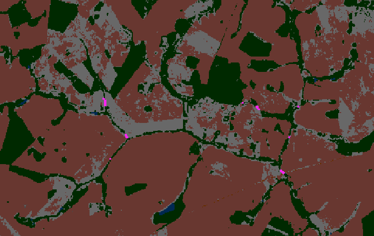
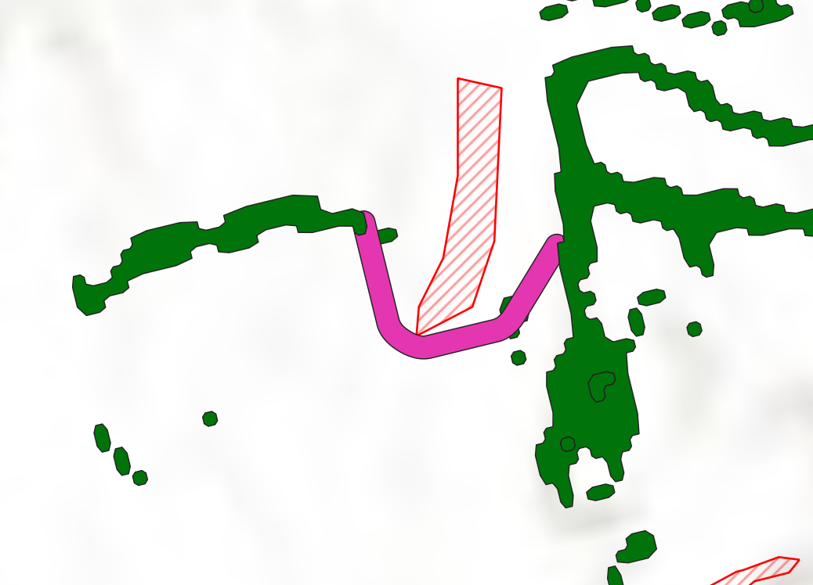

# Linkscape QGIS Plugin v1.5

**Ecological Corridor Optimization for Habitat Connectivity**

Linkscape is a QGIS plugin that identifies and optimizes ecological corridors to connect fragmented habitat patches. Using graph-theoretic algorithms, it helps conservation planners maximize landscape connectivity within constrained budgets.



Image: Corridors generated (pink) to strategically connect the maximum amount of forested area (green) while avoiding impassable land type (orange)

---

## Table of Contents

1. [Overview](#overview)
2. [Installation & Access](#installation--access)
3. [Quick Start Guide](#quick-start-guide)
4. [Raster Workflow](#raster-workflow)
5. [Vector Workflow](#vector-workflow)
6. [Optimization Strategies](#optimization-strategies)
7. [Technical Details](#technical-details)
8. [Tips & Best Practices](#tips--best-practices)
9. [Troubleshooting](#troubleshooting)
10. [Credits](#credits)

---

## Overview

### What Does Linkscape Do?

Linkscape analyzes habitat patches (either raster cells or vector polygons) and identifies optimal corridors to connect them based on:
- **Available budget** (in pixels or hectares/acres)
- **Spatial constraints** (maximum search distance, corridor width requirements)
- **Optimization strategy** (maximize total connectivity vs. create one large patch)

### Key Features

- **Dual Workflow Support**: Works with both raster (e.g., land cover grids) and vector (e.g., polygon shapefiles) data
- **Flexible Patch Definition**: Define habitat patches by pixel values, ranges, or existing polygons
- **Focused Optimization Strategies**:
  - **Most Connectivity**: Maximize the total connected habitat area across the landscape
  - **Largest Patch**: Create one maximally large connected habitat patch
- **Raster Obstacle Controls & Bottleneck Handling**: Clip corridors against raster values/ranges and decide whether corridors may squeeze through gaps smaller than the configured minimum width (vector mode now routes without obstacle inputs)
- **Budget-Constrained Analysis**: Control corridor construction costs in pixels or area units
- **Unit Flexibility**: Vector mode supports both metric (hectares/meters) and imperial (acres/feet) units
- **Automatic CRS Handling**: Vector mode auto-projects geographic layers to UTM for accurate measurements

## What's New in v1.5 (since v1.4)
- **Obstacle avoidance in Vector mode**: Previous versions only allowed the user to define an obstacle land type in Raster mode, now this can be done in Vector mode too. This creates areas that are impassable, so the generation of a corridor either navigates around them or finds a better spot for a corridor. 
- **Stepping-stone logic**: Tiny patches that fall below the min-size filter can now be traversed at zero cost without painting corridors over habitat, letting you string together efficient routes through small fragments.

- **Safer obstacles**: Obstacle masks are now purely user-driven; habitat is no longer auto-added, reducing conflicts between patch filtering and routing.


---



Image: Corridor generated (pink) to connect patches and avoid impassable obstacles

## Installation & Access

### Prerequisites

- QGIS 3.x
- Python packages (typically included with QGIS):
  - `numpy`
  - `gdal` (OSGEO)
  - `PyQt5`
- Optional: `opencv-python` (for faster raster component labeling)

### Installing the Plugin

1. Download the Linkscape plugin folder
2. Copy it to your QGIS plugins directory:
   - **Windows**: `C:\Users\[username]\AppData\Roaming\QGIS\QGIS3\profiles\default\python\plugins\`
   - **macOS**: `~/Library/Application Support/QGIS/QGIS3/profiles/default/python/plugins/`
   - **Linux**: `~/.local/share/QGIS/QGIS3/profiles/default/python/plugins/`
3. Restart QGIS
4. Enable the plugin: **Plugins → Manage and Install Plugins → Installed → Linkscape (SORUS)**

### Accessing Linkscape

**Method 1: Toolbar/Menu**
- Click the Linkscape icon in the toolbar
- Or select **Plugins → Linkscape (SORUS) → Run Linkscape**

**Method 2: Processing Toolbox**
- Open **Processing → Toolbox**
- Navigate to **SORUS → Linkscape Corridor Analysis**

---

## Quick Start Guide

### Basic Workflow

1. **Load Your Data**
   - For raster analysis: Load a land cover or habitat suitability raster
   - For vector analysis: Load a polygon layer representing habitat patches

2. **Launch Linkscape**
   - Click the Linkscape toolbar icon or use the Processing Toolbox

3. **Configure Settings**
   - Select layer type (Raster or Vector)
   - Choose your input layer
   - Define patch criteria and analysis parameters
   - Select optimization strategy
   - Decide on output location (file or temporary layer)

4. **Run Analysis**
   - Click OK to start processing
   - Monitor progress in the Python console (optional)
   - View results automatically added to your QGIS project

5. **Interpret Results**
   - Raster: Corridor pixels are valued by the total size of connected areas they create
   - Vector: Corridor polygons include attributes showing connected area, efficiency, and patch IDs

---

## Raster Workflow

### When to Use Raster Mode

Use raster mode when working with:
- Land cover classifications
- Habitat suitability models
- Gridded ecological data
- Any raster where cells represent discrete habitat types or quality levels

### Patch Definition

#### Value Mode (Default)
Define patches by specific raster values:
- **Single value**: `3` (cells with value 3 are habitat)
- **Multiple values**: `3,5,7` (cells with values 3, 5, or 7 are habitat)
- **Tip**: Use comma-separated values without spaces

#### Range Mode
Define patches by a continuous range:
- Enable the "Use Range" checkbox
- Set **Lower Bound** and **Upper Bound**
- Example: `0.7` to `1.0` for high-suitability habitat from a continuous model

### Obstacle Definition

Use the **Obstacle Definition (Raster)** panel to declare areas corridors must avoid:
- Enable the obstacle checkbox to activate the constraint
- Enter one or more raster values (comma-separated) *or* toggle **Use range** and provide lower/upper bounds
- Any non-habitat cells matching these criteria are treated as impassable during corridor routing
- Leave the option disabled when no exclusion zones are required
- Values you designate as habitat patches are automatically treated as obstacles, so you never need to re-enter them here

Use the **Allow corridors to pass through bottlenecks** toggle (beneath the obstacle inputs) to decide whether corridors may squeeze through gaps that are narrower than the configured minimum width. Leave it checked for legacy behaviour, or uncheck it to strictly enforce the requested width everywhere.

### Raster Parameters

#### Connectivity (Required)
- **4-connectivity**: Patches connect only horizontally/vertically (cardinal directions)
- **8-connectivity**: Patches connect horizontally, vertically, and diagonally
- **Note**: This setting applies to BOTH patch labeling and corridor connectivity

#### Min Patch Size (pixels)
- Minimum number of connected pixels required for a patch to be included
- Smaller patches are filtered out before corridor analysis
- **Default**: `0` (no filtering)
- **Example**: Set to `100` to exclude patches smaller than 100 pixels

#### Budget (pixels) (Required)
- Total number of pixels available for corridor construction
- Determines how many corridors can be created
- **Example**: `5000` allows up to 5000 pixels of corridors across all connections

#### Max Search Distance (pixels) (Required)
- Maximum distance between patches to consider for corridor connections
- Patches farther apart than this value will not be connected
- **Example**: `50` only considers corridors up to 50 pixels long
- **Tip**: Larger values increase computation time but may find more connections
- **Suggestion**: start near 2–3× your raster’s patch diameter; use the progress message to gauge runtime.

#### Max Corridor Area (pixels)
- Optional upper limit on individual corridor size
- Prevents any single corridor from exceeding this area
- **Default**: None (no limit)
- **Example**: `500` rejects corridors larger than 500 pixels

#### Min Corridor Width (pixels)
- Minimum corridor thickness enforced during analysis—corridor centerlines are dilated to this width in the output raster.
- Combine with the **Allow corridors to pass through bottlenecks** toggle (in the obstacle panel) to decide whether narrow gaps are acceptable.
- **Default**: `3`

#### Value Tolerance
- Numerical tolerance for comparing raster values (handles floating-point precision)
- **Default**: `0.000001` (1e-6)
- **When to adjust**: If your raster has unusual precision or comparison issues

#### NoData Fallback
- Value to treat as NoData if the raster doesn't have NoData defined
- **Default**: `-9999`

### Raster Output

**Output Type**: GeoTIFF raster

**Pixel Values**:
- `0`: Background (non-corridor areas)
- `>0`: Corridor pixels, where the value represents the **total connected area size** (in pixels) created by that corridor
  - Higher values = corridors connecting larger total areas
  - Useful for visualizing corridor importance

**Symbology Tips**:
- Use graduated colors to highlight high-value corridors
- Filter by value to show only the most important connections

---

## Vector Workflow

### When to Use Vector Mode

Use vector mode when working with:
- Existing habitat patch polygons (shapefiles, GeoPackages)
- Protected area networks
- Forest stand boundaries
- Any polygon dataset representing discrete habitat patches

### Unit System Selection

Vector mode supports two unit systems that automatically convert all parameters:

#### Metric (Default)
- **Area**: Hectares (ha)
- **Distance**: Meters (m)

#### Imperial
- **Area**: Acres (ac)
- **Distance**: Feet (ft)

**Tip**: You can switch unit systems at any time—parameter values will auto-convert!

### Vector Parameters

#### Output File Name
- Name for the GeoPackage file (if saving to disk)
- **Default**: `linkscape_corridors.gpkg`
- Automatically appends `.gpkg` extension if not provided

#### Min Corridor Width (m or ft) (Required)
- Minimum width for corridor polygons
- Determines the buffer distance around shortest-path lines between patches
- **Metric example**: `200` creates 200-meter-wide corridors
- **Imperial example**: `656` creates 656-foot-wide (≈200m) corridors

#### Max Corridor Area (ha or ac)
- Optional upper limit on individual corridor size
- Prevents oversized corridors from consuming the budget
- **Example (metric)**: `10.0` rejects corridors larger than 10 hectares

#### Min Patch Size (ha or ac) (Required)
- Minimum area for a polygon to be considered a habitat patch
- Smaller patches are filtered out before analysis
- **Default**: `10.0` hectares (or equivalent in acres)
- **Example**: `5.0` includes patches down to 5 hectares

#### Budget Area (ha or ac) (Required)
- Total area available for corridor construction
- Determines how much new habitat/corridor can be created
- **Example**: `50.0` hectares allows 50 ha of total corridors

#### Max Search Distance (m or ft) (Required)
- Maximum distance between patch edges to consider connections
- Only patch pairs closer than this distance are evaluated
- **Example**: `5000` meters (5 km) only connects patches within 5 km
- **Tip**: Affects computational performance—smaller distances = faster
- **Suggestion**: Measure a few real patch gaps and start with ~2–3× that value; increase only if no candidates are found.

> **Note:** Vector obstacle avoidance is disabled in v1.4 while the feature is refined. Corridors are generated directly between patch pairs and clipped only against the connected patches themselves.

### Vector Output

**Output Type**: GeoPackage with polygon layer(s)

**Layer Naming**:
- Most Connectivity: `Corridors (Most Connectivity)`
- Largest Patch: `Corridors (Largest Patch)`

**Attribute Fields**:
- `corridor_id`: Unique identifier for each corridor
- `patch_ids`: Comma-separated list of connected patch IDs
- `area_ha` or `area_ac`: Area of the corridor polygon
- `conn_area_ha` or `conn_area_ac`: Total connected area (patches + corridor)
- `efficiency`: Ratio indicating corridor effectiveness (area cost per unit connected)

**Coordinate Reference System (CRS)**:
- Input polygons are automatically reprojected to the appropriate UTM zone for accurate area/distance calculations
- Output is transformed back to the original layer CRS
- Geographic (lat/lon) layers trigger an informational message about the temporary projection

---

## Optimization Strategies

Linkscape offers three distinct strategies for corridor selection. Choose based on your conservation goals:

### Strategy 1: Most Connectivity

**Goal**: Maximize the total amount of connected habitat across the entire landscape

**How It Works**:
1. Calculates "efficiency" for each possible corridor: `(Patch1 Area + Patch2 Area) / Corridor Cost`
2. Sorts corridors by efficiency (highest benefit per unit cost first)
3. Greedily selects efficient corridors until budget is exhausted
4. Uses Union-Find algorithm to track connected components and avoid redundant connections

**Best For**:
- Landscape-scale connectivity planning
- Maximizing the number of independent patches that become connected
- Situations where multiple small connections are preferable to one large patch
- Network resilience (creating multiple connection pathways)

**Output Characteristics**:
- Multiple connected groups may form across the landscape
- Tends to create more corridors of smaller individual size
- Prioritizes connecting previously isolated patches

**Example Use Case**: 
A watershed with many small forest fragments where you want to connect as many fragments as possible within a restoration budget.

### Strategy 2: Largest Patch

**Goal**: Create one maximally large connected habitat patch

**How It Works**:
1. Tests multiple "seed" patches (up to 20 largest patches by area)
2. For each seed, iteratively finds the shortest (smallest-area) corridor to any nearby unconnected patch
3. Keeps adding patches to the growing network until budget is exhausted
4. Selects the seed that resulted in the largest final connected area

**Best For**:
- Core habitat creation for area-sensitive species
- Establishing a single large reserve or protected area
- Situations prioritizing one large patch over many small ones (e.g., interior forest species)
- Creating a central hub for meta-population dynamics

**Output Characteristics**:
- One large connected component with many merged patches
- May use fewer corridors than Most Connectivity strategy
- Focuses budget on expanding one contiguous area

**Example Use Case**:
Creating a large forest interior habitat for wide-ranging mammals like bears, which require extensive contiguous territory.

## Technical Details (Under the hood)

### Algorithms & Methods

#### Connected Component Labeling
- **Raster**: Uses OpenCV (`cv2.connectedComponents`) if available, otherwise falls back to NumPy-based Union-Find implementation
- **Vector**: Uses QGIS spatial index for neighbor queries

#### Corridor Finding
- **Raster**: Breadth-first search (BFS) from patch boundaries to find shortest paths through non-habitat pixels
- **Vector**: Nearest-point geometry operations with configurable buffer width

#### Optimization
- **Union-Find Data Structure**: Efficiently tracks connected components during greedy corridor selection
- **Spatial Indexing**: QgsSpatialIndex for fast proximity queries in vector mode

#### Performance Considerations
- Raster processing time scales with image size and number of patches
- Vector processing time scales with number of patches and search distance
- Both modes: Larger budgets and search distances increase computation

### File Formats

**Raster**:
- **Input**: Any GDAL-supported raster format (GeoTIFF, IMG, etc.)
- **Output**: GeoTIFF with LZW compression, tiled structure, BIGTIFF support

**Vector**:
- **Input**: Any OGR-supported vector format (Shapefile, GeoPackage, GeoJSON, etc.)
- **Output**: GeoPackage (`.gpkg`) with separate layers per strategy

### Data Requirements

**Raster**:
- Single-band raster (multiband not supported)
- Integer or floating-point values
- Optional NoData definition (or specify fallback value)

**Vector**:
- Polygon geometry type (points and lines not supported)
- Must have valid geometries (automatically validated during processing)
- Any CRS supported (auto-reprojection to UTM for analysis)

### Coordinate Reference Systems

**Raster**: 
- Analysis performed in the raster's native CRS
- Ensure CRS has meaningful distance units (e.g., meters, feet) for distance parameters

**Vector**:
- Geographic (lat/lon) layers automatically reprojected to appropriate UTM zone
- Projected layers used as-is if units are suitable
- Output returned in original layer's CRS

---

## Tips & Best Practices

### General Workflow

1. **Start with Temporary Outputs**: Use temporary layers for quick experimentation without cluttering your workspace
2. **Iterate Parameters**: Try multiple parameter combinations to understand sensitivity
3. **Check Console Output**: View detailed progress and statistics in the Python Console (Plugins → Python Console)
4. **Validate Inputs**: Ensure your input data has valid geometries/values before running

### Raster-Specific Tips

1. **Pixel Resolution Matters**: All distance parameters are in pixels
   - For a 30m resolution raster, `Max Search Distance = 50` means 1,500 meters
   - Calculate pixel equivalents: `(desired_meters / resolution) = pixels`

2. **Memory Considerations**: Very large rasters (>10,000 × 10,000 pixels) may require substantial RAM

3. **Connectivity Choice**:
   - Use 4-connectivity for conservative, cardinal-only corridors
   - Use 8-connectivity for more flexible diagonal pathways
   - Match the connectivity to how your species moves

4. **Value Tolerance**: If working with floating-point habitat suitability models, increase tolerance slightly (e.g., `0.001`) to account for precision issues

### Vector-Specific Tips

1. **Unit Conversions**: Don't manually convert between metric and imperial—use the unit selector and let Linkscape handle it

2. **Min Patch Size**: Balance between excluding trivial patches and maintaining landscape realism
   - Too low: Many tiny patches increase computation
   - Too high: May exclude ecologically important small patches

3. **Corridor Width**:
   - Consider species-specific movement needs (e.g., wider for large mammals)
   - Regulatory requirements (e.g., minimum buffer widths)
   - Typical range: 100-500 meters for terrestrial wildlife

4. **CRS Awareness**: If your layer is in a geographic CRS (lat/lon), the auto-reprojection message is normal and ensures accurate area calculations

### Budget Setting

- **Too Small**: May not connect any patches (zero corridors created)
- **Too Large**: Analysis completes but doesn't use full budget (diminishing returns)
- **Good Practice**: Set budget 10-20% higher than minimum needed to allow optimization flexibility
- **Raster Rule of Thumb**: `Budget ≈ (average patch separation in pixels) × (number of desired connections)`
- **Vector Rule of Thumb**: `Budget ≈ (min corridor width × average distance) × (number of desired connections) / 10000` (in hectares)

### Interpreting Results

**Raster**:
- High-value pixels indicate corridors creating large connected areas
- Symbolize output using graduated colors to highlight priority corridors
- Use `r.stats` or zonal statistics to quantify connected area distributions

**Vector**:
- Sort attribute table by `efficiency` (descending) to see most cost-effective corridors
- Use `conn_area_ha/ac` to identify corridors contributing to largest patches
- Visualize using graduated symbology based on connected area or efficiency

---

## Troubleshooting

### Common Issues

#### "No patches found after filtering"
**Cause**: Min Patch Size is too large, or no pixels/polygons match patch criteria
**Solution**: 
- Lower Min Patch Size
- Check patch definition values/ranges match your data
- Verify input data has expected values/features

#### "No feasible corridors found"
**Cause**: Max Search Distance is too small, or budget is insufficient
**Solution**:
- Increase Max Search Distance
- Increase Budget
- Reduce Min Patch Size to include more potential connection targets

#### "Selected optimization did not produce any corridors"
**Cause**: Even the shortest possible corridor exceeds the budget
**Solution**:
- Increase Budget parameter
- Reduce Min Corridor Width (vector mode)
- Increase Max Corridor Area to allow larger individual corridors

#### Raster: "Cannot open raster source"
**Cause**: Layer file path is invalid or layer removed from project
**Solution**:
- Re-add layer to QGIS project
- Ensure file path is accessible (not on disconnected network drive)

#### Vector: "Selected layer is not a valid vector layer"
**Cause**: Layer is not polygon type, or layer is corrupted
**Solution**:
- Verify layer geometry type (must be polygons)
- Check layer validity: Vector → Geometry Tools → Check Validity
- Try reloading the layer

#### Long Processing Times
**Cause**: Large datasets, high search distances, or many patches
**Solution**:
- Reduce Max Search Distance (most impactful)
- Increase Min Patch Size to reduce number of patches
- For raster: Resample to coarser resolution for initial testing
- For vector: Simplify geometries or dissolve small patches

#### "OpenCV not available" (Raster mode)
**Cause**: `opencv-python` not installed
**Impact**: Raster labeling uses slower NumPy fallback
**Solution** (optional): Install OpenCV in QGIS Python environment:
```bash
# Windows
python-qgis.bat -m pip install opencv-python

# macOS/Linux
pip3 install opencv-python
```

---

## Troubleshooting: Console Errors

If you encounter errors, check the Python Console for detailed messages:
1. Open **Plugins → Python Console**
2. Look for red error text or tracebacks
3. Common error patterns:
   - `GDAL` errors → Raster format or projection issues
   - `QgsGeometry` errors → Invalid vector geometries
   - `MemoryError` → Dataset too large for available RAM

---

## Output Statistics Summary

Both modes print detailed summary statistics after completion:

### Raster Statistics
- Strategy used
- Number of corridors created
- Number of connections made (Most Connectivity)
- Largest connected group size
- Budget used vs. available
- Processing time

### Vector Statistics
- Strategy used
- Number of corridors created
- Seed patch ID and area (Largest Patch)
- Final patch size (Largest Patch)
- Total connected area (Most Connectivity)
- Largest group area (Most Connectivity)
- Number of patches merged
- Budget used vs. available (in selected units)
- Processing time

---

## Credits

**Linkscape QGIS Plugin v1.4**  
© 2025 Benjamin Bishop
Released November 2025
Special thanks to our beta tester: Yannis Bellwald from Switzerland


**Algorithm**: Linkscape v1.5  
**Platform**: QGIS 3.x  
**License**: License

For questions, bug reports, or feature requests, contact SORUSconsulting@gmail.com

---

## Version History

**v1.4** 
- Focused on dual strategies, better raster searches, prioritized Largest Patch growth, and automatic run summaries.

**v1.3**
- Reverted vector corridors to direct linear buffering while retaining obstacle clipping
- Refreshed documentation and metadata for the 1.1.1 release

**v1.1**
- Documentation refresh and metadata alignment for the 1.1 release

**v1.0**
- Dual raster/vector workflow support
- Two optimization strategies (Most Connectivity, Largest Patch)
- Metric and imperial unit support (vector mode)
- Temporary layer output option
- Automatic CRS handling for vector data
- Processing Toolbox integration
- Enhanced error handling and user feedback

---

## Appendix: Parameter Quick Reference

### Raster Parameters
| Parameter | Unit | Required | Default | Description |
|-----------|------|----------|---------|-------------|
| Patch Values | - | Yes* | - | Comma-separated values or range |
| Connectivity | - | Yes | 4 | 4 or 8 neighbor connectivity |
| Min Patch Size | pixels | No | 0 | Minimum patch size to include |
| Budget | pixels | Yes | - | Total corridor area budget |
| Max Search Distance | pixels | Yes | - | Maximum corridor length |
| Max Corridor Area | pixels | No | None | Maximum individual corridor size |
| Min Corridor Width | pixels | No | 1 | Minimum corridor width |
| Value Tolerance | - | No | 1e-6 | Numerical comparison tolerance |
| NoData Fallback | - | No | -9999 | NoData value if undefined |

*Either patch values OR range must be specified

### Vector Parameters
| Parameter | Unit | Required | Default | Description |
|-----------|------|----------|---------|-------------|
| Output File Name | - | No | linkscape_corridors.gpkg | Output GeoPackage name |
| Unit System | - | Yes | metric | metric or imperial |
| Min Corridor Width | m/ft | Yes | 200 | Corridor buffer width |
| Max Corridor Area | ha/ac | No | None | Maximum individual corridor size |
| Min Patch Size | ha/ac | Yes | 10.0 | Minimum patch area to include |
| Budget Area | ha/ac | Yes | - | Total corridor area budget |
| Max Search Distance | m/ft | Yes | - | Maximum connection distance |

---

**End of Documentation**
