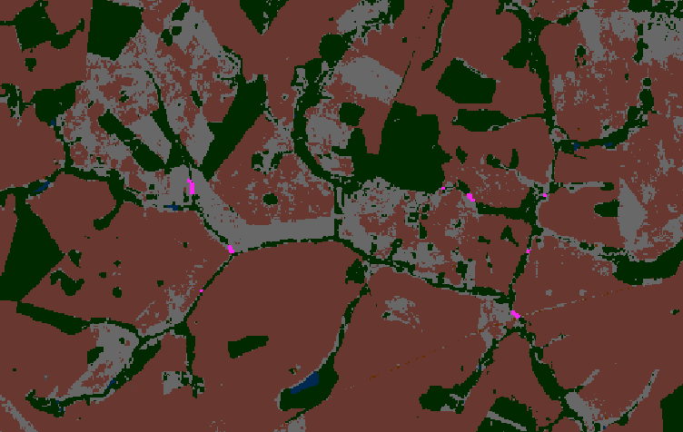

# TerraLink QGIS Plugin 1.7.0

**Ecological corridor planning for habitat connectivity**

TerraLink is a QGIS plugin for building and comparing habitat-corridor scenarios under spatial, budget, and barrier constraints. It supports raster and vector inputs, four optimization modes, optional impassable areas, and a PRE/POST landscape-metrics report for scenario comparison.

Image: example corridor output connecting habitat while avoiding impassable land.

---

## What Is Current In 1.7.0

- Reframed dialog with clearer sections for input, goal, constraints, obstacles, advanced metrics, and output.
- Shared corridor backend across input modes:
  raster inputs are polygonized and then analyzed with the vector corridor engine.
- Expanded PRE/POST landscape-metrics reporting, including structural, flow/redundancy, and composite connectivity metrics.
- Advanced connectivity-metric controls in the dialog for PC, redundancy method, strategic mobility, and metric weights.
- More consistent summary outputs, including in-project table layers and a vector summary CSV.

---

## Table of Contents

1. [What TerraLink Does](#what-terralink-does)
2. [Installation and Access](#installation-and-access)
3. [How The Current Architecture Works](#how-the-current-architecture-works)
4. [Quick Start](#quick-start)
5. [Optimization Modes](#optimization-modes)
6. [Input Modes and Parameters](#input-modes-and-parameters)
7. [Advanced Connectivity Metrics](#advanced-connectivity-metrics)
8. [Outputs](#outputs)
9. [Landscape Metrics Report](#landscape-metrics-report)
10. [Tips and Best Practices](#tips-and-best-practices)
11. [Troubleshooting](#troubleshooting)
12. [Credits and Contact](#credits-and-contact)

---

## What TerraLink Does

TerraLink identifies candidate corridors between habitat patches and selects a set of corridors that best matches a chosen connectivity objective within your constraints.

In practice, you specify:

- the habitat layer
- the optimization mode
- minimum patch size
- corridor width
- maximum search distance
- corridor budget
- optional impassable areas
- optional species-oriented settings for Reachable Habitat

TerraLink then runs the corridor analysis, adds output layers to QGIS, and writes comparison-oriented summaries.

It is designed for scenario testing rather than one-shot “optimal truth.” The intended workflow is to run several plausible settings and compare the mapped outputs and PRE/POST metrics.

---

## Installation and Access

### Requirements

- QGIS 3.22 or newer
- Standard QGIS Python environment with NumPy, GDAL/OGR, and PyQt

### Install From ZIP

1. Download the TerraLink plugin ZIP.
2. In QGIS, open `Plugins` -> `Manage and Install Plugins`.
3. Choose `Install from ZIP`.
4. Select the ZIP and install it.

### Where To Launch It

After installation, TerraLink is available from:

- the toolbar as `Run TerraLink`
- the QGIS plugin menu
- the Processing Toolbox under `SORUS` -> `TerraLink` -> `Open TerraLink`

---

## How The Current Architecture Works

TerraLink has two **input modes**, not two separate corridor engines.

### Vector input mode

If you start with polygon habitat patches, TerraLink analyzes those polygons directly.

### Raster input mode

If you start with a raster, TerraLink:

1. reads the habitat values you selected
2. builds habitat and optional impassable masks
3. polygonizes those masks into temporary vector layers
4. sends those polygon layers into the same corridor-generation backend used by vector runs

That means:

- raster and vector runs share the same corridor-selection backend
- optimization behavior is intended to be consistent across both modes
- differences between raster and vector results mostly come from the input representation, patch definition, and units, not from separate optimization engines

This is the main architectural point the README needed to reflect.

---

## Quick Start

1. Load a habitat layer into QGIS.
2. Open TerraLink from the toolbar, menu, or Processing Toolbox.
3. Choose `Raster` or `Vector` input mode.
4. Select the input layer.
5. Set the optimization mode.
6. Set minimum patch size, corridor width, budget, and maximum search distance.
7. Add impassable values or layers if needed.
8. Choose an output folder or keep temporary output enabled.
9. Click `Run`.
10. Review the `Log` tab, map layers, and landscape-metrics report.

---

## Optimization Modes

TerraLink currently exposes four optimization modes in both raster and vector input modes.

### Largest Single Network

- Goal: prioritize one dominant connected network.
- Best for: backbone-style consolidation.
- Behavior: after selection, TerraLink enforces a single largest connected output if disconnected corridor fragments remain.

### Most Connected Area

- Goal: maximize total habitat area contained in connected networks.
- Best for: broad structural integration across the landscape.
- Behavior: this is the structural “connect the most habitat” mode.

### Landscape Fluidity

- Goal: improve movement quality, shortcut efficiency, and redundancy within the network.
- Best for: reducing detours and improving internal mobility rather than only increasing connected area.
- Behavior: can retain more than one useful connection pattern when redundancy meaningfully improves the network.

### Reachable Habitat (Advanced)

- Goal: maximize gain in reachable habitat under a species movement assumption.
- Best for: species-oriented planning where dispersal distance matters.
- Key inputs: species dispersal distance, dispersal kernel, optional minimum patch area for the species, optional patch-quality field for vector inputs, and patch-area scaling.

---

## Input Modes and Parameters

### Raster Input Mode

Raster mode is for land-cover or habitat rasters where one or more raster values define habitat.

### Raster parameters

- `Layer type`: `Raster`
- `Input layer`: raster layer to analyze
- `Raster units`: `Pixels`, `Metric`, or `Imperial`
- `Pixel neighborhood`: 4- or 8-neighbor patch definition
- `Patch values`: one or more habitat values
- `Min patch size`
- `Budget`
- `Corridor width`
- `Max search distance`
- `Assign corridor cells`
- optional `Impassable values`
- optional `Allow corridors to pass through bottlenecks`

### Raster units

- `Pixels` keeps patch size, budget, corridor width, and search distance in raster-cell units.
- `Metric` and `Imperial` are available for projected rasters that can be measured in meters/feet.
- If the raster CRS is not suitable for measured units, use `Pixels` or reproject the raster first.

### Raster barriers

Raster impassables are configured as value lists or ranges. Habitat cells are treated separately from impassables so corridors can meet patch edges. Bottleneck handling controls whether corridors may squeeze through narrow gaps that would otherwise be blocked by the width constraint.

### Vector Input Mode

Vector mode is for polygon habitat patches where each feature represents one patch.

### Vector parameters

- `Layer type`: `Vector`
- `Input layer`: polygon patch layer
- `Vector units`: `Metric` or `Imperial`
- `Min patch size`
- `Budget`
- `Corridor width`
- `Max search distance`
- optional impassable polygon layers
- optional navigator `Grid cell size` for routing around impassables

### Vector requirements

- The input must be a valid polygon layer.
- The run must contain at least two valid patches after filtering.
- Very large patch counts may be rejected for performance reasons.

### Species-oriented options

When `Reachable Habitat (Advanced)` is selected, TerraLink exposes:

- species dispersal distance
- dispersal kernel
- minimum patch area for the species
- patch area scaling
- patch quality field for vector layers

The patch-quality field is only available for vector inputs.

---

## Advanced Connectivity Metrics

The dialog includes an `Advanced Connectivity Metrics` section. These controls feed the plugin's advanced connectivity calculations used in reports and comparison-oriented analysis.

Current controls include:

- dispersal alpha for Probability of Connectivity
- PC cutoff distance
- redundancy metric selection:
  `Shortest-Path Efficiency (IME)` or `Effective Resistance (FRI)`
- sample counts used for redundancy estimation
- strategic mobility controls
- Landscape Fluidity shortcut threshold
- weights for:
  `m`, `LCC`, `PC`, and `Flow`

The weights are normalized internally and used for the composite connectivity score reported in the landscape-metrics output.

---

## Outputs

TerraLink always adds outputs to QGIS. When you save to disk, it also writes output files. When `temporary output` is enabled, mapped layers are added as temporary layers and reports are written to temporary files.

### Corridor Outputs

The current saved corridor backend is vector-based.

- Saved runs write a GeoPackage of corridor outputs.
- Vector-style corridor layers are added to QGIS for both raster and vector input modes.
- Saved runs also write a `Contiguous Areas` layer representing dissolved patch-plus-corridor networks.

In other words, **raster input does not currently produce a native corridor raster output**. Raster input is converted to polygon patches and the resulting outputs follow the vector backend.

### Corridor attributes

Vector corridor outputs include corridor-level attributes such as:

- patch identifiers
- corridor area
- connected area
- efficiency
- multipart/segment-style flags used by the export logic

### Contiguous areas output

Saved and temporary runs also produce a contiguous-network output representing connected patch-plus-corridor systems.

### Reports And Summary Tables

Both raster and vector runs produce:

- a landscape-metrics text report
- a landscape-metrics table layer in QGIS

Vector-backend runs also produce:

- a vector summary CSV
- a QGIS table layer based on that CSV

Because raster input delegates into the vector backend, raster runs also follow this vector-style summary pattern.

### Raster-Only Display Option

The raster dialog still includes `Assign corridor cells` with these choices:

- `Sum area of patches directly connected`
- `Sum area of total network`
- `Efficiency (corridor area / connected patches)`

These settings are still part of the raster parameter surface, but they should not be interpreted as evidence of a separate native raster corridor-output pipeline.

---

## Landscape Metrics Report

Each run writes a PRE/POST landscape-metrics report for comparison across scenarios.

The report currently includes a broader connectivity suite than the old README described. Depending on the run and available methods, the report can include:

- total connected habitat area
- habitat-normalized mesh (`m`)
- largest connected component (`LCC`)
- Probability of Connectivity (`PC`)
- robustness via `delta-PC`
- redundancy/flow using `IME` or `FRI`
- mean effective resistance
- landscape fluidity
- strategic mobility
- a composite connectivity score based on weighted `m`, `LCC`, `PC`, and flow terms

For `Reachable Habitat (Advanced)` runs, the report can also include:

- Reachable Habitat Score
- mean reachable area
- median reachable area
- largest reachable habitat cluster

### How to use these metrics

- Compare scenarios on the same landscape rather than treating any one metric as an absolute truth.
- Interpret structural and functional metrics separately.
- Be careful about scale, raster resolution, and patch definition.
- Use mapped outputs and the metrics report together.

---

## Tips and Best Practices

- Start with a smaller study area or conservative budget to confirm settings before scaling up.
- Keep maximum search distance realistic; very large values increase runtime.
- For raster inputs, start with simple habitat values first.
- For vector inputs, fix invalid geometries before running if you suspect topology issues.
- Use temporary output while iterating quickly, then save to disk once you have a scenario worth keeping.
- Compare multiple runs rather than over-interpreting a single result.

---

## Troubleshooting

### No corridors produced

- Increase budget.
- Increase maximum search distance.
- Reduce corridor width.
- Make sure at least two habitat patches remain after filtering.

### Reachable Habitat selects little or nothing

- Increase species dispersal distance.
- Increase budget.
- Reduce corridor width.
- Check whether your minimum patch area for species is too restrictive.

### Impassables seem wrong

- Raster: confirm the impassable values actually occur in the raster.
- Vector: confirm selected impassable layers are valid polygon layers.
- Vector: reduce navigator grid cell size if thin barriers are being missed.

### Measured units fail in raster mode

- Reproject the raster to a suitable projected CRS, or switch raster units to `Pixels`.

### Runs are slow

- Reduce study area.
- Increase minimum patch size.
- Use a smaller search distance.
- Simplify barriers or disable them temporarily for diagnosis.

### Landscape metrics fail

- TerraLink still attempts to save an error report if the metrics step fails.
- Check the generated report path in the `Log` tab.

---

## Credits and Contact

TerraLink was created by Ben Bishop at SORUS as a practical QGIS tool for habitat-connectivity planning.

Bug reports and feature requests are welcome through the GitHub issue tracker listed in the plugin metadata or by email at `benjamin.bishop@sorusconsultingllc.com`.
